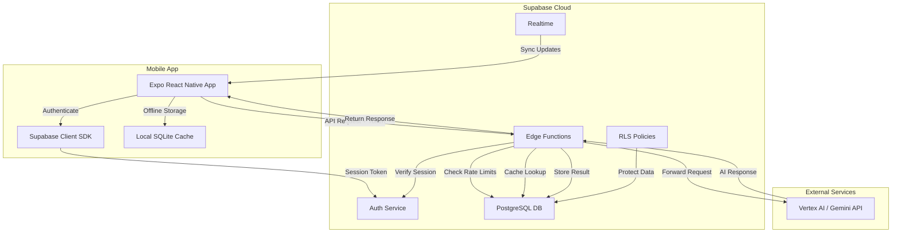

# API Security Architecture for "What Can I Eat" Mobile Application

## Executive Summary

The current implementation exposes the Gemini API key through `EXPO_PUBLIC_GEMINI_API_KEY` in the client-side code, creating a critical security vulnerability. This document provides a comprehensive solution for securing API keys through a Supabase-based backend proxy architecture.

## Current Security Issues

1. **Exposed API Keys**: Using `EXPO_PUBLIC_*` environment variables makes the API key visible in the compiled app bundle
2. **No Access Control**: Anyone with the API key can make unlimited requests
3. **No Usage Tracking**: Cannot monitor or limit individual user consumption
4. **Cost Risk**: Exposed keys can lead to unexpected API costs from abuse
5. **Compliance Risk**: Handling health-related data requires proper security measures

## Recommended Solution: Supabase Backend Architecture

After analyzing all options and considering your requirements, I recommend using **Supabase** as the backend solution:
- **Supabase Edge Functions** for the API proxy
- **Supabase Auth** for user management
- **PostgreSQL Database** for rate limiting, caching, and analytics
- **Row Level Security (RLS)** for data protection
- **Supabase Storage** for image handling (if needed)

### Why Supabase?

1. **Cost-Effective**: Generous free tier (500MB database, 2GB bandwidth, 500K Edge Function invocations)
2. **Open Source**: Avoid vendor lock-in, self-hostable when needed
3. **PostgreSQL**: Powerful relational database for complex queries
4. **Security**: Built-in RLS, secure API key storage
5. **Developer Experience**: Excellent SDKs for React Native/Expo
6. **Scalability**: Easy migration to self-hosted instance when growing

## Architecture Overview



## Detailed Implementation Plan

### 1. Supabase Project Setup

```sql
-- Database schema
CREATE TABLE users_quota (
    user_id UUID REFERENCES auth.users PRIMARY KEY,
    daily_requests INTEGER DEFAULT 0,
    monthly_requests INTEGER DEFAULT 0,
    last_reset_daily TIMESTAMP DEFAULT NOW(),
    last_reset_monthly TIMESTAMP DEFAULT NOW(),
    tier TEXT DEFAULT 'free',
    created_at TIMESTAMP DEFAULT NOW()
);

CREATE TABLE api_usage_logs (
    id UUID DEFAULT gen_random_uuid() PRIMARY KEY,
    user_id UUID REFERENCES auth.users,
    request_type TEXT NOT NULL,
    menu_items_count INTEGER,
    response_time_ms INTEGER,
    cached BOOLEAN DEFAULT FALSE,
    error TEXT,
    created_at TIMESTAMP DEFAULT NOW()
);

CREATE TABLE menu_analysis_cache (
    id UUID DEFAULT gen_random_uuid() PRIMARY KEY,
    menu_hash TEXT UNIQUE NOT NULL,
    dietary_type TEXT NOT NULL,
    analysis_result JSONB NOT NULL,
    created_at TIMESTAMP DEFAULT NOW(),
    expires_at TIMESTAMP DEFAULT NOW() + INTERVAL '7 days'
);

-- Indexes for performance
CREATE INDEX idx_api_usage_user_created ON api_usage_logs(user_id, created_at);
CREATE INDEX idx_menu_cache_hash ON menu_analysis_cache(menu_hash);
CREATE INDEX idx_menu_cache_expires ON menu_analysis_cache(expires_at);
```

### 2. Edge Functions Implementation

```typescript
// supabase/functions/analyze-menu/index.ts
import { serve } from "https://deno.land/std@0.168.0/http/server.ts"
import { createClient } from 'https://esm.sh/@supabase/supabase-js@2'
import { GoogleGenerativeAI } from "npm:@google/generative-ai@0.1.0"

const corsHeaders = {
  'Access-Control-Allow-Origin': '*',
  'Access-Control-Allow-Headers': 'authorization, x-client-info, apikey, content-type',
}

serve(async (req) => {
  // Handle CORS
  if (req.method === 'OPTIONS') {
    return new Response('ok', { headers: corsHeaders })
  }

  try {
    // Create Supabase client with user context
    const authHeader = req.headers.get('Authorization')!
    const supabaseClient = createClient(
      Deno.env.get('SUPABASE_URL') ?? '',
      Deno.env.get('SUPABASE_ANON_KEY') ?? '',
      { global: { headers: { Authorization: authHeader } } }
    )

    // Verify user authentication
    const { data: { user }, error: authError } = await supabaseClient.auth.getUser()
    if (authError || !user) {
      return new Response(
        JSON.stringify({ error: 'Unauthorized' }),
        { status: 401, headers: { ...corsHeaders, 'Content-Type': 'application/json' } }
      )
    }

    // Check rate limits
    const rateLimitOk = await checkRateLimit(supabaseClient, user.id)
    if (!rateLimitOk) {
      return new Response(
        JSON.stringify({ error: 'Rate limit exceeded' }),
        { status: 429, headers: { ...corsHeaders, 'Content-Type': 'application/json' } }
      )
    }

    // Parse request body
    const { dietaryPreferences, menuItems } = await req.json()

    // Check cache first
    const cacheKey = generateCacheKey(dietaryPreferences, menuItems)
    const cachedResult = await getCachedResult(supabaseClient, cacheKey)
    
    if (cachedResult) {
      await logUsage(supabaseClient, user.id, 'cached', menuItems.length)
      return new Response(
        JSON.stringify({ ...cachedResult, cached: true }),
        { headers: { ...corsHeaders, 'Content-Type': 'application/json' } }
      )
    }

    // Initialize Gemini AI with secure API key
    const genAI = new GoogleGenerativeAI(Deno.env.get('GEMINI_API_KEY')!)
    const model = genAI.getGenerativeModel({ model: "gemini-1.5-flash" })

    // Prepare and send request to Gemini
    const prompt = buildAnalysisPrompt(dietaryPreferences, menuItems)
    const result = await model.generateContent(prompt)
    const response = await result.response
    const analysis = parseGeminiResponse(response.text())

    // Cache the result
    await cacheResult(supabaseClient, cacheKey, dietaryPreferences.type, analysis)

    // Log usage
    await logUsage(supabaseClient, user.id, 'api_call', menuItems.length)

    // Update user quota
    await updateUserQuota(supabaseClient, user.id)

    return new Response(
      JSON.stringify({ ...analysis, cached: false }),
      { headers: { ...corsHeaders, 'Content-Type': 'application/json' } }
    )

  } catch (error) {
    console.error('Error:', error)
    return new Response(
      JSON.stringify({ error: 'Internal server error' }),
      { status: 500, headers: { ...corsHeaders, 'Content-Type': 'application/json' } }
    )
  }
})

// Helper functions
async function checkRateLimit(supabase: any, userId: string): Promise<boolean> {
  const { data, error } = await supabase
    .from('users_quota')
    .select('daily_requests, tier, last_reset_daily')
    .eq('user_id', userId)
    .single()

  if (error || !data) {
    // Create quota record for new user
    await supabase.from('users_quota').insert({ user_id: userId })
    return true
  }

  // Reset daily counter if needed
  const lastReset = new Date(data.last_reset_daily)
  const now = new Date()
  if (now.getDate() !== lastReset.getDate()) {
    await supabase
      .from('users_quota')
      .update({ daily_requests: 0, last_reset_daily: now })
      .eq('user_id', userId)
    return true
  }

  // Check limits based on tier
  const limits = {
    free: 10,
    premium: 100,
    unlimited: 999999
  }
  
  return data.daily_requests < (limits[data.tier] || limits.free)
}

function generateCacheKey(preferences: any, items: any[]): string {
  const content = JSON.stringify({ preferences, items })
  return crypto.subtle.digest('SHA-256', new TextEncoder().encode(content))
    .then(hash => Array.from(new Uint8Array(hash))
      .map(b => b.toString(16).padStart(2, '0'))
      .join(''))
}

async function getCachedResult(supabase: any, cacheKey: string): Promise<any | null> {
  const { data, error } = await supabase
    .from('menu_analysis_cache')
    .select('analysis_result')
    .eq('menu_hash', cacheKey)
    .gt('expires_at', new Date().toISOString())
    .single()

  return data?.analysis_result || null
}

async function cacheResult(supabase: any, cacheKey: string, dietaryType: string, result: any) {
  await supabase
    .from('menu_analysis_cache')
    .insert({
      menu_hash: cacheKey,
      dietary_type: dietaryType,
      analysis_result: result
    })
}

async function logUsage(supabase: any, userId: string, requestType: string, itemCount: number) {
  await supabase
    .from('api_usage_logs')
    .insert({
      user_id: userId,
      request_type: requestType,
      menu_items_count: itemCount,
      response_time_ms: Date.now() - startTime
    })
}

async function updateUserQuota(supabase: any, userId: string) {
  await supabase.rpc('increment_user_requests', { user_id: userId })
}

function buildAnalysisPrompt(preferences: any, items: any[]): string {
  // Use the same prompt structure as the current implementation
  return `Analyze these menu items for dietary restrictions...`
}

function parseGeminiResponse(text: string): any {
  try {
    return JSON.parse(text)
  } catch {
    // Handle non-JSON responses
    return { results: [], error: 'Invalid response format' }
  }
}
```

### 3. Row Level Security (RLS) Policies

```sql
-- Enable RLS on all tables
ALTER TABLE users_quota ENABLE ROW LEVEL SECURITY;
ALTER TABLE api_usage_logs ENABLE ROW LEVEL SECURITY;
ALTER TABLE menu_analysis_cache ENABLE ROW LEVEL SECURITY;

-- Users can only see their own quota
CREATE POLICY "Users can view own quota" ON users_quota
    FOR SELECT USING (auth.uid() = user_id);

-- Users can only see their own usage logs
CREATE POLICY "Users can view own logs" ON api_usage_logs
    FOR SELECT USING (auth.uid() = user_id);

-- Cache is public read (but only through Edge Functions)
CREATE POLICY "Public read cache" ON menu_analysis_cache
    FOR SELECT USING (true);

-- Only service role can insert/update
CREATE POLICY "Service role insert" ON users_quota
    FOR INSERT WITH CHECK (auth.role() = 'service_role');
CREATE POLICY "Service role update" ON users_quota
    FOR UPDATE WITH CHECK (auth.role() = 'service_role');
```

### 4. Mobile App Integration

```typescript
// src/services/api/supabaseService.ts
import { createClient } from '@supabase/supabase-js'
import AsyncStorage from '@react-native-async-storage/async-storage'
import { GeminiRequest, GeminiResponse } from '../../types'

const supabaseUrl = process.env.EXPO_PUBLIC_SUPABASE_URL!
const supabaseAnonKey = process.env.EXPO_PUBLIC_SUPABASE_ANON_KEY!

export const supabase = createClient(supabaseUrl, supabaseAnonKey, {
  auth: {
    storage: AsyncStorage,
    autoRefreshToken: true,
    persistSession: true,
    detectSessionInUrl: false,
  },
})

export class SecureGeminiService {
  private startTime: number = 0;

  async analyzeMenu(request: GeminiRequest): Promise<GeminiResponse> {
    this.startTime = Date.now();
    
    try {
      // Ensure user is authenticated
      const { data: { session } } = await supabase.auth.getSession()
      if (!session) {
        // Sign in anonymously if not authenticated
        const { error } = await supabase.auth.signInAnonymously()
        if (error) throw error
      }

      // Call Edge Function
      const { data, error } = await supabase.functions.invoke('analyze-menu', {
        body: {
          dietaryPreferences: request.dietaryPreferences,
          menuItems: request.menuItems,
        }
      })

      if (error) throw error

      return {
        success: true,
        results: data.results || [],
        confidence: data.confidence || 0.8,
        message: data.message,
        requestId: request.requestId,
        processingTime: Date.now() - this.startTime,
      }
    } catch (error) {
      // Handle offline mode
      if (!navigator.onLine) {
        return this.getOfflineResponse(request)
      }
      
      return {
        success: false,
        results: [],
        confidence: 0,
        message: error instanceof Error ? error.message : 'Analysis failed',
        requestId: request.requestId,
        processingTime: Date.now() - this.startTime,
      }
    }
  }

  private async getOfflineResponse(request: GeminiRequest): Promise<GeminiResponse> {
    // Check local cache
    const cached = await this.checkLocalCache(request)
    if (cached) return cached

    // Return offline message
    return {
      success: false,
      results: [],
      confidence: 0,
      message: 'Offline mode - please connect to analyze menu',
      requestId: request.requestId,
      processingTime: 0,
    }
  }

  private async checkLocalCache(request: GeminiRequest): Promise<GeminiResponse | null> {
    // Implement local caching logic
    return null
  }
}
```

### 5. Authentication Strategy

```typescript
// src/services/auth/authService.ts
import { supabase } from '../api/supabaseService'
import { Session } from '@supabase/supabase-js'

export class AuthService {
  // Start with anonymous auth for MVP
  async initializeAuth(): Promise<Session | null> {
    const { data: { session } } = await supabase.auth.getSession()
    
    if (!session) {
      // Create anonymous session
      const { data, error } = await supabase.auth.signInAnonymously()
      if (error) {
        console.error('Auth error:', error)
        return null
      }
      return data.session
    }
    
    return session
  }

  // Future: Upgrade anonymous to permanent account
  async upgradeAccount(email: string, password: string) {
    const { data, error } = await supabase.auth.updateUser({
      email,
      password,
    })
    return { data, error }
  }

  // Future: Social login
  async signInWithOAuth(provider: 'google' | 'apple') {
    const { data, error } = await supabase.auth.signInWithOAuth({
      provider,
      options: {
        redirectTo: 'whatcanieat://auth-callback',
      }
    })
    return { data, error }
  }

  // Sign out
  async signOut() {
    const { error } = await supabase.auth.signOut()
    return { error }
  }
}
```

### 6. Offline Support & Caching

```typescript
// src/services/cache/offlineCache.ts
import AsyncStorage from '@react-native-async-storage/async-storage'
import * as SQLite from 'expo-sqlite'
import { createHash } from 'crypto'

export class OfflineCache {
  private db: SQLite.SQLiteDatabase

  constructor() {
    this.db = SQLite.openDatabase('whatcanieat.db')
    this.initializeDatabase()
  }

  private async initializeDatabase() {
    this.db.transaction(tx => {
      tx.executeSql(`
        CREATE TABLE IF NOT EXISTS menu_cache (
          id INTEGER PRIMARY KEY AUTOINCREMENT,
          menu_hash TEXT UNIQUE,
          dietary_type TEXT,
          analysis_result TEXT,
          created_at INTEGER,
          expires_at INTEGER
        )
      `)
      
      tx.executeSql(`
        CREATE INDEX IF NOT EXISTS idx_menu_hash ON menu_cache(menu_hash)
      `)
    })
  }

  async getCached(menuHash: string): Promise<any | null> {
    return new Promise((resolve) => {
      this.db.transaction(tx => {
        tx.executeSql(
          'SELECT * FROM menu_cache WHERE menu_hash = ? AND expires_at > ?',
          [menuHash, Date.now()],
          (_, { rows }) => {
            if (rows.length > 0) {
              resolve(JSON.parse(rows.item(0).analysis_result))
            } else {
              resolve(null)
            }
          }
        )
      })
    })
  }

  async cache(menuHash: string, dietaryType: string, result: any) {
    const expiresAt = Date.now() + (7 * 24 * 60 * 60 * 1000) // 7 days
    
    this.db.transaction(tx => {
      tx.executeSql(
        `INSERT OR REPLACE INTO menu_cache 
         (menu_hash, dietary_type, analysis_result, created_at, expires_at) 
         VALUES (?, ?, ?, ?, ?)`,
        [menuHash, dietaryType, JSON.stringify(result), Date.now(), expiresAt]
      )
    })
  }

  generateHash(data: any): string {
    return createHash('sha256').update(JSON.stringify(data)).digest('hex')
  }
}
```

### 7. Cost Analysis

#### Supabase Free Tier (Perfect for MVP)
- **Database**: 500MB (sufficient for ~1M analysis records)
- **Edge Functions**: 500K invocations/month
- **Bandwidth**: 2GB/month
- **Auth**: Unlimited users
- **Storage**: 1GB (if needed for images)
- **Cost**: $0/month

#### Supabase Pro Tier (When scaling)
- **Database**: 8GB
- **Edge Functions**: 2M invocations/month
- **Bandwidth**: 50GB/month
- **Cost**: $25/month

#### Self-Hosted Supabase (Future option)
- **Infrastructure**: ~$20-50/month on DigitalOcean/AWS
- **Unlimited usage**
- **Full control**
- **No vendor lock-in**

### 8. Migration Path

#### Phase 1: Development (Current)
- Use exposed API key for rapid development
- Implement Supabase backend in parallel

#### Phase 2: Beta Testing
1. Deploy Supabase Edge Functions
2. Update mobile app to use Supabase client
3. Implement anonymous authentication
4. Test with limited users

#### Phase 3: Production Launch
1. Remove `EXPO_PUBLIC_GEMINI_API_KEY` from codebase
2. Store API key in Supabase Edge Function environment
3. Enable rate limiting and monitoring
4. Implement user registration flow

#### Phase 4: Scale (Optional)
1. Monitor usage and costs
2. Optimize caching strategies
3. Consider self-hosting if needed
4. Implement premium tiers

### 9. Security Checklist

- [ ] API keys removed from client code
- [ ] Supabase RLS policies enabled
- [ ] Edge Functions use environment variables
- [ ] Authentication required for all API calls
- [ ] Rate limiting implemented
- [ ] Request/response validation
- [ ] Error messages don't leak sensitive info
- [ ] HTTPS enforced everywhere
- [ ] API usage monitoring enabled
- [ ] Backup strategy implemented

### 10. Monitoring & Analytics

```sql
-- Usage analytics views
CREATE VIEW daily_usage_stats AS
SELECT 
    DATE(created_at) as date,
    COUNT(*) as total_requests,
    COUNT(DISTINCT user_id) as unique_users,
    AVG(response_time_ms) as avg_response_time,
    SUM(CASE WHEN cached THEN 1 ELSE 0 END) as cached_requests
FROM api_usage_logs
GROUP BY DATE(created_at);

CREATE VIEW user_tier_distribution AS
SELECT 
    tier,
    COUNT(*) as user_count,
    AVG(daily_requests) as avg_daily_requests
FROM users_quota
GROUP BY tier;

-- Function to increment user requests
CREATE OR REPLACE FUNCTION increment_user_requests(user_id UUID)
RETURNS void AS $$
BEGIN
    UPDATE users_quota 
    SET daily_requests = daily_requests + 1,
        monthly_requests = monthly_requests + 1
    WHERE user_id = user_id;
END;
$$ LANGUAGE plpgsql SECURITY DEFINER;
```

## Implementation Timeline

1. **Week 1**: Set up Supabase project, create database schema
2. **Week 2**: Implement Edge Functions and test API proxy
3. **Week 3**: Update mobile app to use Supabase SDK
4. **Week 4**: Implement offline support and caching
5. **Week 5**: Testing and optimization
6. **Week 6**: Production deployment

## Conclusion

Using Supabase provides a secure, scalable, and cost-effective solution for protecting your Vertex AI API keys while maintaining excellent performance and user experience. The architecture supports your growth from MVP to scale, with the option to self-host when needed.

Key benefits:
- **Security**: API keys never exposed to clients
- **Cost Control**: Rate limiting and usage tracking
- **Performance**: Caching and offline support
- **Scalability**: From free tier to self-hosted
- **Developer Experience**: Familiar PostgreSQL and excellent SDKs